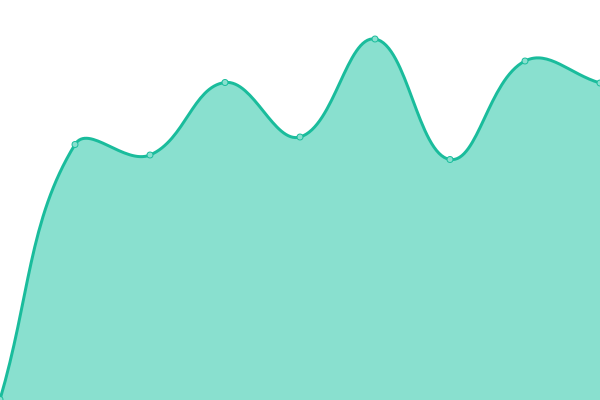

# [📈 Live Status](https://status.stefftek.de): <!--live status--> **🟧 Partial outage**

This repository contains the open-source uptime monitor and status page for [SteffTek](https://stefftek.de), powered by [Upptime](https://github.com/upptime/upptime).

With [Upptime](https://upptime.js.org), you can get your own unlimited and free uptime monitor and status page, powered entirely by a GitHub repository. We use [Issues](https://github.com/stefftek/Status/issues) as incident reports, [Actions](https://github.com/stefftek/Status/actions) as uptime monitors, and [Pages](https://status.stefftek.de) for the status page.

<!--start: status pages-->
<!-- This summary is generated by Upptime (https://github.com/upptime/upptime) -->
<!-- Do not edit this manually, your changes will be overwritten -->
<!-- prettier-ignore -->
| URL | Status | History | Response Time | Uptime |
| --- | ------ | ------- | ------------- | ------ |
|  [SteffTek.de](https://stefftek.de/) | 🟩 Up | [steff-tek-de.yml](https://github.com/SteffTek/Status/commits/HEAD/history/steff-tek-de.yml) | 

 958ms
     
 | 

<a href="https://status.stefftek.de/history/steff-tek-de">100.00%</a>
    

|  [Discord Virgin Slayer](https://dvs.stefftek.de/) | 🟩 Up | [discord-virgin-slayer.yml](https://github.com/SteffTek/Status/commits/HEAD/history/discord-virgin-slayer.yml) | 

 1289ms
     
 | 

<a href="https://status.stefftek.de/history/discord-virgin-slayer">100.00%</a>
    

|  [Virgin Slayer V3](https://virginslayer.app/) | 🟩 Up | [virgin-slayer-v3.yml](https://github.com/SteffTek/Status/commits/HEAD/history/virgin-slayer-v3.yml) | 

 142ms
     
 | 

<a href="https://status.stefftek.de/history/virgin-slayer-v3">100.00%</a>
    

|  [Virgin Slayer V3 API](https://api.virginslayer.app/) | 🟩 Up | [virgin-slayer-v3-api.yml](https://github.com/SteffTek/Status/commits/HEAD/history/virgin-slayer-v3-api.yml) | 

 934ms
     
 | 

<a href="https://status.stefftek.de/history/virgin-slayer-v3-api">100.00%</a>
    

|  [Image API](https://images.stefftek.de/) | 🟥 Down | [image-api.yml](https://github.com/SteffTek/Status/commits/HEAD/history/image-api.yml) | 

 562ms
     
 | 

<a href="https://status.stefftek.de/history/image-api">0.00%</a>
    

|  [Internet Game](https://internet.stefftek.de/) | 🟥 Down | [internet-game.yml](https://github.com/SteffTek/Status/commits/HEAD/history/internet-game.yml) | 

 681ms
     
 | 

<a href="https://status.stefftek.de/history/internet-game">0.00%</a>
    

|  [UnTubed](https://untubed.de/) | 🟥 Down | [un-tubed.yml](https://github.com/SteffTek/Status/commits/HEAD/history/un-tubed.yml) | 

 0ms
     
 | 

<a href="https://status.stefftek.de/history/un-tubed">0.00%</a>
    

|  [UnTubed API](https://api.untubed.de/) | 🟥 Down | [un-tubed-api.yml](https://github.com/SteffTek/Status/commits/HEAD/history/un-tubed-api.yml) | 

 0ms
     
 | 

<a href="https://status.stefftek.de/history/un-tubed-api">0.00%</a>
    

|  UnTubed Webhook | 🟥 Down | [un-tubed-webhook.yml](https://github.com/SteffTek/Status/commits/HEAD/history/un-tubed-webhook.yml) | 

 0ms
     
 | 

<a href="https://status.stefftek.de/history/un-tubed-webhook">0.00%</a>
    

<!--end: status pages-->

[**Visit our status website →**](https://status.stefftek.de)

## 📄 License

- Powered by: [Upptime](https://github.com/upptime/upptime)
- Code: [MIT](./LICENSE) © [SteffTek](https://stefftek.de)
- Data in the `./history` directory: [Open Database License](https://opendatacommons.org/licenses/odbl/1-0/)
